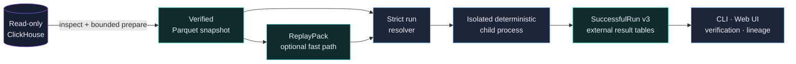

<div align="center">
  
  <br>
  <p>
    <a href="https://www.python.org/"></a>
    
    
    
    
  </p>
  <p><strong>Reproducible on-chain backtests from verified local artifacts, with no SQL or network access in the event loop.</strong></p>
  <p>
    <a href="#quick-start">Quick start</a> ·
    <a href="#features">Features</a> ·
    <a href="#how-it-works">Architecture</a> ·
    <a href="#documentation">Documentation</a> ·
    <a href="#support-the-project">Support</a> ·
    <a href="#contributing">Contributing</a>
  </p>
</div>

---

## Solana research integration

This fork adds a Carbon/ClickHouse source adapter and the `dnipro-backtest` CLI
for frozen Pump.fun snapshots and next-slot leader-copy research. It retains
exact raw amounts, tracks observed fees and open inventory, and publishes
verified immutable artifacts. These observational backtests have execution and
coverage limits; they do not establish exact transaction landing or full-wallet PnL.

See the [integration guide](docs/dnipro-integration.md) for commands and data
contracts, and the [security review](security/REVIEW.md) for the dependency fixes,
worker credential isolation, and recorded validation. The upstream engine and
MIT license are retained below.

On-Chain Backtest Engine selectively reads a requested range from an external read-only
ClickHouse source, publishes an immutable canonical Parquet snapshot, and
replays it deterministically on a single Linux, macOS, or Windows host with
16–32 GB of RAM and local NVMe storage. The supported Windows path currently
runs through WSL2 with Ubuntu; a native Windows runtime has not completed its
compatibility gate.

The project is a Python modular monolith. The CLI and Web UI call the same
application use cases, heavy jobs run in isolated child processes, and semantic
identity is kept separate from physical execution settings. It does not require
S3, PostgreSQL, a local ClickHouse service, Kafka, Kubernetes, or multi-host
workers.

The Web UI is built with **React and TypeScript**. Sniping, Copy Buy and
FirstSwap share one **Strategy results** dashboard with summary cards,
charts, entry/exit analytics, trade details and verified lineage. The old
interface has been removed; existing result bookmarks open the React app.
See [deep-dive §34.2](docs/architecture-deep-dive.md#342-web-ui) for its bounded
query contract.

> [!IMPORTANT]
> The current working surface includes the reference stack and exact Pump.fun
> Sniping. The project is in alpha: every new source range requires its own
> bounded evidence pass and may correctly stop fail closed.

> [!NOTE]
> Pump.fun Sniping now supports separate identity-bearing `EXOGENOUS_REPLAY`
> and `EXOGENOUS_VIRTUAL_SETTLEMENT` modes through required draft v3, summary
> v3, and round-trip v4 contracts. Virtual settlement explicitly labels
> synthetic sell funding and is not an on-chain executability claim. Switching
> modes requires resolving a new run and changes `logical_run_id`, but reuses
> the existing verified Dataset/Snapshot/ReplayPack without extraction or
> ReplayPack compilation.

Pump.fun Copy Buy is available through the reference engine and CLI/API/Web UI
under the separate deep-dive §23.5 contract: copy BUYs by `signing_wallet`, attempt
each token once, and sell by fee-free price TP/SL or maximum holding time.
Four sell attempts include pre-submit rejections; retries wait two modeled
seconds before a fresh decision. It requires newly prepared signer-bearing
history and a proven full settlement tail. See the
[implementation and admission limits](docs/architecture-deep-dive.md#34-current-project-state). Optimized copy
and materialized schedules remain unavailable; existing Sniping admission
and fixed semantics are unchanged.

**Strategy results:** start `backtest serve` with your data-root configuration,
open **Strategy results**, then **Results**. Every strategy uses the same tabs:
**Overview**, **Entries**, **Exits**, **Trades**, **Verification**. Pump trade details open
in a large overlay with SOL market-cap history, the original signal, actual
entry/exit and failed attempts. **Around trade** / **Full history** changes the
local view without reloading history. Charts use verified retained snapshots
of up to 10 million rows, 128 files and 1 GiB. They filter the selected token's
venue before decoding, with a ten-second scan budget and at most 4,000 exact
points; unrelated tokens do not become Python event objects. Actual entry/exit
markers come from stored fills, while rejected or failed attempts remain distinct;
missing history and exceeded query limits are explicit errors. FirstSwap PnL is marked inapplicable; a chart without the required historical
evidence is explicitly unavailable. Neither is invented.

## Features

| Capability | Current contract |
|---|---|
| Selective acquisition | Bounded read-only ClickHouse queries with explicit columns, hard limits, and gap-safe preparation |
| Local storage | Immutable canonical Parquet, verified manifests, and content-addressed references |
| Deterministic replay | Reference engine, mmap ReplayPack, and optional DeliverySchedule with no SQL/network in the hot loop |
| Pump.fun Sniping | `EXOGENOUS_REPLAY` and explicit synthetic `EXOGENOUS_VIRTUAL_SETTLEMENT`: exact non-Mayhem universe, `+500` global transactions before buy, `+2s` before the sell decision, integer fees, and ledger-authoritative PnL |
| Pump.fun Copy Buy | Reference execution, exact signer BUY signals, one token entry, fee-free price TP/SL or timeout, and four bounded sell attempts |
| Verifiable equivalence | Canonical Parquet reference, ReplayPack reference, and NumPy mmap optimized paths are checked for byte-identical outputs under the same admitted exact contract |
| Job control | Durable SQLite queue, isolated child processes, cancel/retry/recovery, and bounded progress |
| Local interface | Typed CLI, loopback-only Control API, and React same-origin Web UI, one shared strategy dashboard, bounded pagination, adaptive progress, charts and lineage diagrams |
| Artifact lifecycle | Verification, lineage, pins, reachability GC, trash grace period, and a verifiable backup/restore contract |
| Exact ML path | Point-in-time features, frozen predictions, and a safe integer-linear runtime |

The sidebar identifies the workspace as **onchain backtest engine**. **English**
is the default, regardless of the browser language; choose **Русский** using
**Language**. **Appearance** offers **Warm sunset** (default) and **Dark**.
Both preferences are stored locally and synchronize across tabs. If storage
is unavailable, the choice remains active in the current tab. Changing language
preserves entered form values, selected result tabs and open trade details.

The UI loads only one bounded table page at a time: 20 jobs, 10 runs, and 25
strategy entries by default. Job and run pages are selected globally newest
first through opaque keyset cursors, so a newly inserted row cannot shift an
already-open continuation page. The Run order comes from a rebuildable manifest-bound SQLite index and
the selected artifacts are reverified. Alternate table sorts/search are
explicitly page-local; arrows request the next server page instead of
downloading the full history. The run list is not polled continuously,
and repeated exact artifact reads reuse only bounded, fingerprint-guarded
process-local verification evidence. A clean restart over an unchanged local
artifact inventory also reuses a durable rebuildable-index receipt; any crash,
inventory drift, or corruption falls back to full verification.

Frontend sources live in `frontend/`. Node.js 22.12+ is required only when
changing or rebuilding the UI: `npm --prefix frontend ci`,
`npm --prefix frontend run generate`, `npm --prefix frontend test`, and
`npm --prefix frontend run build`. The build writes packaged static assets;
`backtest serve` needs no Node server. Browser checks run with
`npm --prefix frontend run test:browser` after installing Playwright Chromium.

## Interface preview

The screenshots below use the browser test fixtures, not a live portfolio or
profitability claim. They show the shared interface in English in the light theme.


The chart close-up uses an illustrative UI fixture with changing values to
show the curve and markers clearly; it is not a historical token or a trading result.

The same tabs serve Sniping, Copy Buy and FirstSwap. Available metrics reflect
each strategy's verified result contract; unsupported metrics stay explicit.

## How it works



External access is limited to `inspect-source`, bounded `prepare-dataset`,
and the optional remote estimate in `plan-dataset`.
Compilation, feature/ML, and backtest paths read only verified committed local
artifacts. The Engine and Strategy never receive a SQL client, credentials, or
future labels.

## Quick start

Python 3.13 and [`uv`](https://docs.astral.sh/uv/) are required. Linux x86_64
and macOS arm64 run natively. On Windows 11 x86_64, use WSL2 with Ubuntu.

Linux and macOS:

```bash
uv sync --all-groups --frozen
source .venv/bin/activate
backtest --help
cp configs/local-16gb.toml configs/local.toml
backtest serve --config configs/local.toml
```

Windows PowerShell first installs and opens WSL2:

```powershell
wsl --install -d Ubuntu
wsl
```

Then run the setup inside Ubuntu, starting from the Windows profile:

```bash
uv sync --all-groups --frozen
source .venv/bin/activate
backtest --help
cp configs/local-windows-wsl2-16gb.toml configs/local.toml
backtest serve --config configs/local.toml
```

From Windows PowerShell, the repository-provided host smoke can be rerun at
any time (the checkout in this example is `~/backtest` inside Ubuntu):

```powershell
wsl --distribution Ubuntu --cd '~/backtest' -- bash scripts/windows-wsl2-smoke.sh
```

Keep the working `data_root` in the WSL2 Linux filesystem, not under `/mnt/c`
or `/mnt/d`; crash durability and mmap semantics on Windows-mounted filesystems
have not passed a dedicated gate. Native Windows runtime CI is not claimed.

The Web UI opens at `http://127.0.0.1:<port>` from the `[control]` section. The
complete path from source inspection to the first exact run is documented in
[Getting Started](docs/getting-started.md). Credentials must come from the
environment, keychain, or a local provider and must never be written to TOML.

## Core workflow

```text
inspect-source
  -> plan-dataset
  -> prepare-dataset
  -> compile-replay             # optional fast path
  -> resolve-run
  -> run / sweep
  -> show-run-summary / list-roundtrips
  -> verify-artifact / show-lineage
```

| Area | Main commands |
|---|---|
| Source and dataset | `inspect-source`, `plan-dataset`, `prepare-dataset` |
| Replay | `compile-replay`, `compile-delivery-schedule` |
| Execution | `resolve-run`, `run`, `sweep` |
| Results | `list-runs`, `describe-run-contract`, `show-run-summary`, `list-roundtrips` |
| Operations | `verify-artifact`, `show-lineage`, pins, GC, backup, and restore verification |

The current syntax is always available through `backtest <command> --help`;
detailed examples are collected in the [CLI reference](docs/cli-reference.md).

## Honest limitations

- Live admission is bound to an exact cut. A new range, mapping, or evidence
  operand requires a new preparation; configuration cannot turn `UNKNOWN` into
  `PROVEN`.
- Arbitrary plugin bundles, tree/ONNX/GPU tolerance runtimes, stateful ML,
  PumpSwap execution, a second network family, and checkpoint/resume are not
  implemented and remain fail closed.
- `EXOGENOUS_VIRTUAL_SETTLEMENT` is executable but deliberately synthetic: it
  never recomputes external trades or mutates historical reserves, and sell
  output beyond observed real SOL is not evidence of on-chain executability.
  Draft v2 must be re-resolved as v3; committed summary v2/round-trip v3 remain
  readable only under their original strict meaning.
- Linux x86_64 and macOS arm64 are native execution targets. Windows 11 x86_64
  is supported through WSL2/Ubuntu; native Windows execution and CI have not
  completed the required durability, process, and determinism gates.
- A remote source requires verified TLS/VPN/SSH or an explicit local acceptance
  of risk. The Control API remains loopback-only.
- A backup counts as a backup only when it is on another physical device/host
  and has passed a restore drill; another directory on the same NVMe does not.

The exact current-vs-target status is recorded in
[§3.4 of the normative deep dive](docs/architecture-deep-dive.md#34-current-project-state).
If this README and the deep dive disagree, the deep dive is authoritative.

## Documentation

| Document | Read it when you need to... |
|---|---|
| [Getting Started](docs/getting-started.md) | Configure the source, prepare a snapshot, and run the first backtest |
| [Web UI guide with screenshots](docs/ui-guide.md) | Follow the main interface workflows step by step |
| [Configuration](docs/configuration.md) | Understand TOML, secret refs, transport, and resource limits |
| [CLI reference](docs/cli-reference.md) | Find commands, exact IDs, and workflows |
| [Project layout](docs/project-layout.md) | Understand the repository structure and local data root |
| [Architecture overview](docs/architecture.md) | Get a concise map of the system |
| [Architecture deep dive](docs/architecture-deep-dive.md) | Verify normative invariants, identity, and failure semantics |
| [Performance baseline](docs/performance-baseline.md) | Reproduce and correctly interpret benchmarks |
| [Documentation index](docs/README.md) | Find the remaining guides and contracts |

## Development and quality

Run the full local gate after changing code:

```bash
.venv/bin/ruff format --check src tests
.venv/bin/ruff check src tests
.venv/bin/mypy src/backtest
.venv/bin/lint-imports
.venv/bin/pytest --cov=backtest --cov-report=term-missing
```

Live ClickHouse and performance tests are separate and opt-in. A normal feature
request does not authorize an architecture change: read the
[normative deep dive](docs/architecture-deep-dive.md) first.

## Indexer: OnchainDivers

This project uses the Solana indexer built by the
[OnchainDivers](https://onchaindivers.com/) team as its external read-only
ClickHouse source of historical on-chain data. Selected data is verified and
stored in immutable local Parquet snapshots before backtesting. We thank the
team for providing the historical data used in the project.

## Support the project

If the project is useful to you, you can support it with a donation:

| Network | Address |
|---|---|
| Bitcoin | `bc1p7xa9amu9pjh5cear5dezulujg2fe86su0afg02w3cpxwp8rkychsvx3cmc` |
| Ethereum (ETH) | `0x9f0d4b76466a2151d1848ba831c1109ec8fff18d` |
| Solana | `D7eLSxAPhJaVE9rjyFPeTK6xEsxis1RpQ5Q3FQRMUG1G` |
| TRON | `TGJFm8HHspMBcJ2maog88cTjzVrqz3izsB` |

See [SUPPORT.md](docs/SUPPORT.md) for other ways to help.

## Contributing

Read [CONTRIBUTING.md](.github/CONTRIBUTING.md) before your first pull request. Report
vulnerabilities through the private process in [SECURITY.md](.github/SECURITY.md), and
use [SUPPORT.md](docs/SUPPORT.md) for operational questions. User-facing changes are
recorded in [CHANGELOG.md](docs/CHANGELOG.md).

## License

This project is distributed under the MIT License. See [LICENSE](LICENSE) for the full
text. Provenance of third-party test layouts is documented in
[Third-Party Notices](docs/THIRD_PARTY_NOTICES.md).

> [!WARNING]
> This is research software, not financial advice. Verify the data,
> assumptions, and results independently; do not use the alpha release to
> manage real funds.

---

**Language:** English · [Русский](docs/README.ru.md) · [简体中文](docs/README.zh-CN.md)
